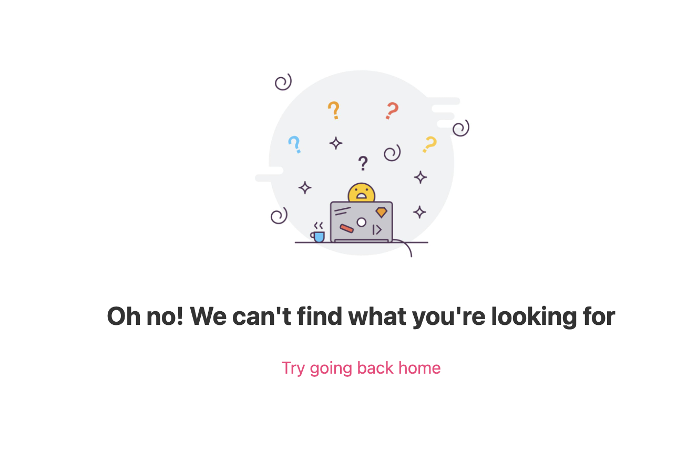

# readme-with-pictures
test




`html`
```html
<section>
  <h1>Some summary</h1>
  <p>Some super fun text</h1>
</section>
```

`js`
```js
const hobjob = {
  array: [1,2,3,4]
  string: "Howdy, reader
}

console.log(hobjob)
```

`javascript`
```javascript
const hobjob = {
  array: [1,2,3,4]
  string: "Howdy, reader
}

console.log(hobjob)
```

`ts`
```ts
interface LabeledValue {
  label: string;
}
 
function printLabel(labeledObj: LabeledValue) {
  console.log(labeledObj.label);
}
 
let myObj = { size: 10, label: "Size 10 Object" };
printLabel(myObj);
```

`typescript`
```typescript
interface LabeledValue {
  label: string;
}
 
function printLabel(labeledObj: LabeledValue) {
  console.log(labeledObj.label);
}
 
let myObj = { size: 10, label: "Size 10 Object" };
printLabel(myObj);
```
